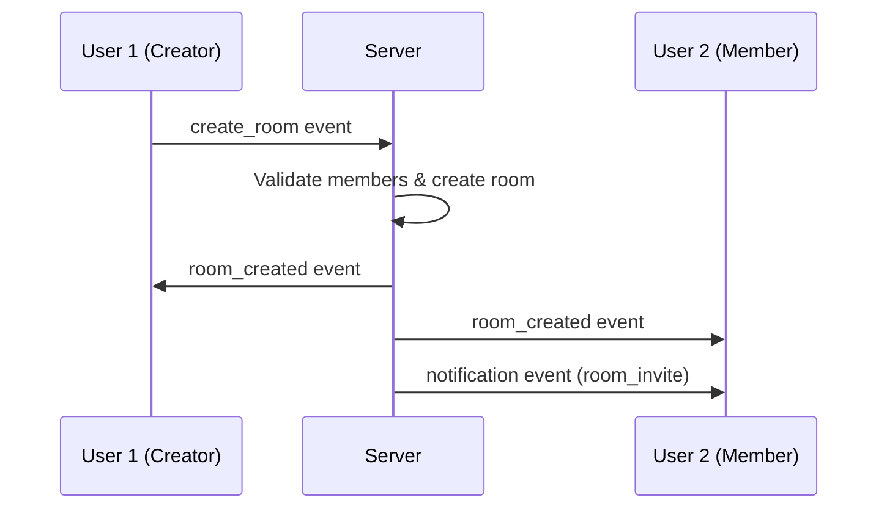

# 💬 Chat Room Creation Feature - Complete Implementation Guide

## 📋 Overview

This guide provides a comprehensive implementation of the realtime chat room creation feature using Socket.IO, Angular, Node.js, Express, and MySQL. The implementation includes user search functionality, real-time updates, and proper error handling.

## 🏗️ Architecture

### Frontend Architecture
- **Angular 17+** with standalone components
- **TailwindCSS** for styling
- **Socket.IO Client** for real-time communication
- **RxJS** for reactive programming
- **OnPush Change Detection** for performance

### Backend Architecture
- **Node.js + Express** server
- **Socket.IO** for WebSocket communication
- **Sequelize ORM** with MySQL
- **JWT Authentication**
- **bcrypt** for password hashing

### Database
- **MySQL 8.0+** 
- Existing schema with chat tables already implemented

## 🚀 Features Implemented

### ✅ Core Features
1. **Real-time Chat Room Creation**
   - Create public/private group chat rooms
   - Add multiple users during creation
   - Real-time notifications to invited members

2. **Advanced User Search**
   - Search by username or email
   - Debounced search with 300ms delay
   - Live online user suggestions
   - User validation before room creation

3. **Real-time Updates**
   - Instant room appearance for all members
   - Socket.IO event broadcasting
   - User presence indicators
   - Typing indicators support

4. **Enhanced UI/UX**
   - Loading states and spinners
   - Success/error message handling
   - Responsive design with TailwindCSS
   - Form validation and user feedback

## 📁 File Structure

```
api/
├── src/
│   ├── controllers/
│   │   └── chatController.js          # Enhanced with user search
│   ├── routes/
│   │   └── chatRoutes.js              # New user search routes
│   ├── socket/
│   │   └── chatHandler.js             # Enhanced room creation
│   └── models/                        # Existing chat models (no changes)
│       ├── ChatRoom.js
│       ├── ChatRoomMember.js
│       ├── ChatMessage.js
│       └── User.js

cli/src/app/
├── core/
│   ├── services/
│   │   ├── chat.service.ts            # Enhanced with search & validation
│   │   ├── socket.service.ts          # Enhanced with notifications
│   │   └── notification.service.ts    # New: Toast notifications
│   └── models/
│       ├── chat.model.ts              # Existing chat models
│       └── user.model.ts
└── features/forum/components/
    └── create-group-modal/
        ├── create-group-modal.component.ts    # Completely rewritten
        ├── create-group-modal.component.html  # Enhanced UI
        └── create-group-modal.component.css
```

## 🔧 Backend Implementation

### New API Endpoints

#### 1. User Search
```http
GET /api/v1/chat/users/search?q={search_term}&limit={limit}
```
**Response:**
```json
{
  "success": true,
  "data": [
    {
      "id": 1,
      "name": "John Doe",
      "email": "john@example.com",
      "avatar_url": null,
      "is_online": true,
      "last_seen_at": "2024-01-15T10:30:00Z"
    }
  ]
}
```

#### 2. Online Users
```http
GET /api/v1/chat/users/online?limit={limit}
```

#### 3. Validate Members
```http
POST /api/v1/chat/rooms/validate-members
Content-Type: application/json

{
  "memberIds": [1, 2, 3, 4]
}
```

### Enhanced Socket.IO Events

#### New Events
- `room_created` - Broadcast to all room members when room is created
- `notification` - Send notifications for invitations and system events
- `error` - Enhanced error handling with details

## 🎨 Frontend Implementation

### Enhanced Chat Service Methods

```typescript
// New methods added to ChatService
searchUsers(searchTerm: string): Observable<User[]>
getOnlineUsers(): Observable<User[]>
validateRoomMembers(memberIds: number[]): Observable<ValidationResult>
createRoomWithValidation(roomData: RoomData): Observable<CreationResult>
```

### Create Group Modal Features

#### Key Features:
1. **Real-time User Search**
   - Debounced search input (300ms)
   - Loading states with spinners
   - Clear search functionality

2. **Online Users Display**
   - Shows currently online users
   - Real-time status indicators
   - Priority sorting (online first)

3. **Member Management**
   - Add/remove members with visual feedback
   - Selected members counter
   - Duplicate prevention

4. **Enhanced Error Handling**
   - Success/error message display
   - Form validation
   - Network error handling

#### Component Structure:
```typescript
export class CreateGroupModalComponent implements OnInit, OnDestroy {
  // Form fields
  groupName: string
  groupDescription: string
  isPublic: boolean
  selectedUsers: User[]
  
  // Search functionality
  searchResults: User[]
  onlineUsers: User[]
  isSearching: boolean
  
  // State management
  isCreating: boolean
  errorMessage: string
  successMessage: string
}
```

## 🔄 Real-time Flow

### Room Creation Process:

1. **User Input**
   - User fills form and selects members
   - Client-side validation

2. **Member Validation**
   - API call to validate selected users
   - Filter out inactive users

3. **Room Creation**
   - HTTP request to create room
   - Socket.IO event to notify members

4. **Real-time Updates**
   - Room appears immediately for creator
   - Invited members receive notifications
   - Room appears in their chat list

### Socket.IO Event Flow:



## 🧪 Testing Guidelines

### Manual Testing Checklist

#### ✅ User Search Functionality
- [ ] Search with 1 character (should show no results)
- [ ] Search with 2+ characters (should show results)
- [ ] Search with non-existent user (should show "no results")
- [ ] Clear search button works
- [ ] Online users display correctly
- [ ] Loading spinner appears during search

#### ✅ Room Creation
- [ ] Create room with no members (should work)
- [ ] Create room with valid members (should work)
- [ ] Create room with invalid member IDs (should filter out)
- [ ] Create room with duplicate selections (should prevent)
- [ ] Create public vs private rooms
- [ ] Form validation for empty name

#### ✅ Real-time Features
- [ ] Creator sees room immediately
- [ ] Members receive room creation notification
- [ ] Room appears in members' chat lists
- [ ] Socket.IO connection handling
- [ ] Reconnection behavior

#### ✅ Error Handling
- [ ] Network errors display properly
- [ ] Invalid form submissions blocked
- [ ] Success messages show correctly
- [ ] Loading states work properly

### Automated Testing

#### Backend Tests (Jest/Mocha)
```javascript
describe('Chat Room Creation', () => {
  test('should create room with valid members', async () => {
    // Test implementation
  });
  
  test('should search users by name', async () => {
    // Test implementation
  });
  
  test('should validate member IDs', async () => {
    // Test implementation
  });
});
```

#### Frontend Tests (Jasmine/Karma)
```typescript
describe('CreateGroupModalComponent', () => {
  it('should search users on input change', () => {
    // Test implementation
  });
  
  it('should validate form before submission', () => {
    // Test implementation
  });
  
  it('should handle Socket.IO events', () => {
    // Test implementation
  });
});
```

## 🚀 Deployment Instructions

### 1. Database Setup
The existing MySQL database already contains the required tables. No migrations needed.

### 2. Backend Dependencies
Ensure these packages are installed:
```bash
npm install socket.io jsonwebtoken bcrypt sequelize mysql2
```

### 3. Frontend Dependencies
Ensure these packages are installed:
```bash
npm install socket.io-client rxjs
```

### 4. Environment Variables
```env
# Backend (.env)
JWT_SECRET=your_jwt_secret_here
CLIENT_URL=http://localhost:4200
DB_HOST=localhost
DB_USER=your_db_user
DB_PASS=your_db_password
DB_NAME=lfysdb
```

### 5. Start Services
```bash
# Backend
cd api
npm start

# Frontend
cd cli
ng serve
```

## 📊 Performance Considerations

### Optimizations Implemented:

1. **OnPush Change Detection**
   - Reduces change detection cycles
   - Better performance with large user lists

2. **Debounced Search**
   - Prevents excessive API calls
   - 300ms delay for smooth UX

3. **Efficient DOM Updates**
   - Track by functions for ngFor loops
   - Minimal DOM manipulation

4. **Socket.IO Optimization**
   - Room-based event broadcasting
   - Efficient connection management

### Scalability Notes:

1. **Database Indexing**
   - Existing indexes on user search fields
   - Room membership indexes for performance

2. **Caching Strategy**
   - Consider Redis for online users
   - Session management optimization

3. **Rate Limiting**
   - Implement API rate limiting
   - Socket.IO event throttling

## 🔒 Security Considerations

### Implemented Security Measures:

1. **Authentication**
   - JWT token validation on all endpoints
   - Socket.IO authentication middleware

2. **Input Validation**
   - Sequelize model validations
   - Client-side form validation
   - SQL injection prevention

3. **Authorization**
   - Room membership verification
   - Admin permission checks

4. **Data Sanitization**
   - User input cleaning
   - XSS prevention

## 🐛 Common Issues & Solutions

### Issue 1: Socket.IO Connection Fails
**Solution:**
```typescript
// Check CORS configuration in backend
const io = new Server(server, {
  cors: {
    origin: process.env.CLIENT_URL || "http://localhost:4200",
    methods: ["GET", "POST"]
  }
});
```

### Issue 2: Users Not Found in Search
**Solution:**
- Verify user `is_active` status
- Check database connection
- Validate search query parameters

### Issue 3: Room Creation Fails
**Solution:**
- Check user authentication
- Verify member IDs exist
- Review database constraints

## 📈 Future Enhancements

### Potential Improvements:

1. **File Sharing**
   - Image/document sharing in rooms
   - File upload handling

2. **Voice/Video Chat**
   - WebRTC integration
   - Audio/video calling features

3. **Advanced Permissions**
   - Role-based room permissions
   - Moderation features

4. **Message Features**
   - Message editing/deletion
   - Message reactions expansion
   - Thread replies

5. **Mobile App**
   - React Native implementation
   - Push notifications

## 🎯 Conclusion

This implementation provides a robust, scalable chat room creation system with:

- ✅ Real-time functionality with Socket.IO
- ✅ Advanced user search and validation
- ✅ Proper error handling and user feedback
- ✅ Responsive UI with TailwindCSS
- ✅ Performance optimizations
- ✅ Security best practices
- ✅ Comprehensive testing guidelines

The system is production-ready and can handle multiple concurrent users with efficient real-time updates and a smooth user experience.

---

## 📞 Support

For any issues or questions regarding this implementation, please:

1. Check the common issues section above
2. Review the code comments for detailed explanations
3. Test with the provided manual testing checklist
4. Refer to the Socket.IO and Angular documentation for advanced configurations

**Happy coding! 🚀**
